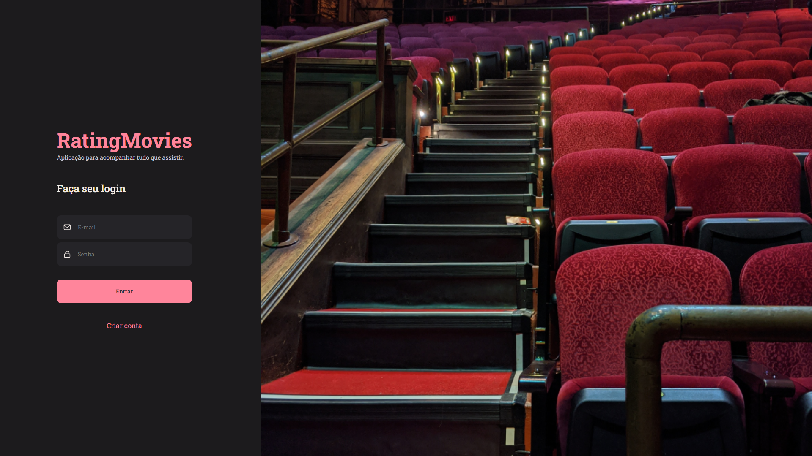
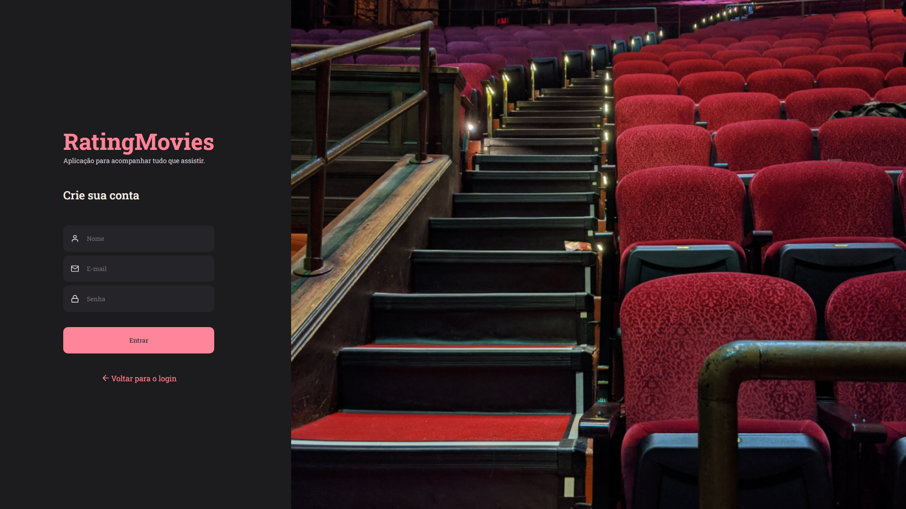
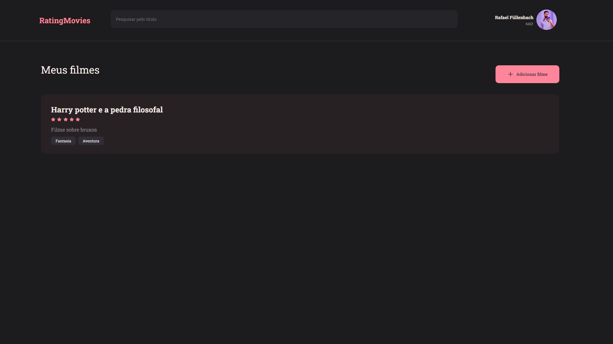
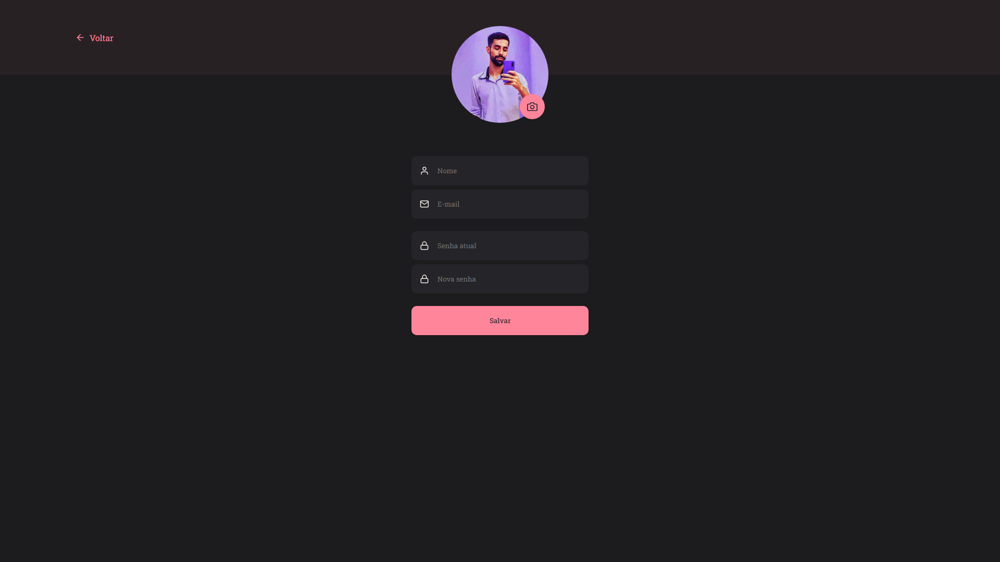
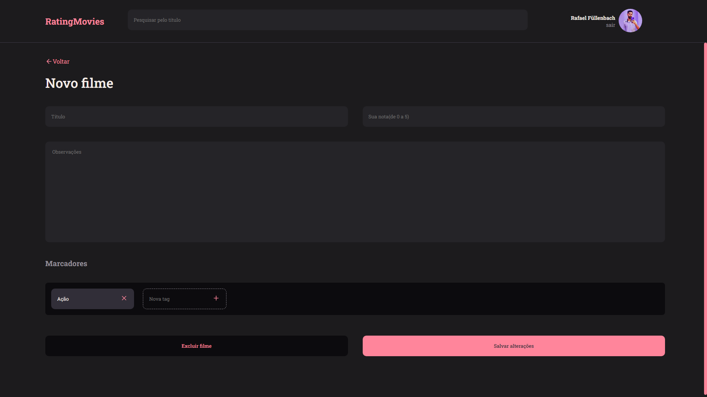
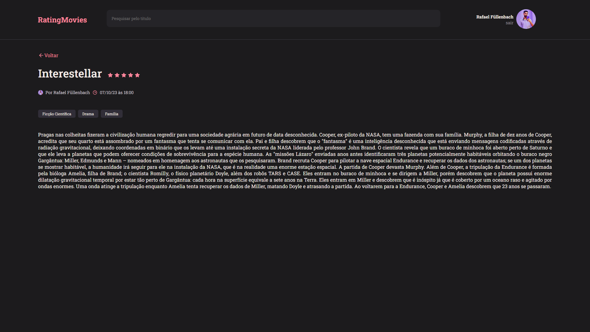

# Rating Movies

The goal of the project is to learn about React.
## Application pages

### Sign In

### Sign Up

### Home

### Profile

### New

### Details

## Apprenticeship

- Vite;
- JSX;
- Styled Components;
- Global Styles;
- Components;
- Props;
- React Router Dom;
- React Icons;

## 🔗 Contact

## 🛠 Skills
React js, Figma, Styled Components
